# Building an Azure Data Lake for Bike Share Data Analytics

### In this project, you'll build a data lake solution for Divvy bikeshare.
Divvy is a bike sharing program in Chicago, Illinois USA that allows riders to purchase a pass at a kiosk or use a mobile application to unlock a bike at stations around the city and use the bike for a specified amount of time. The bikes can be returned to the same station or to another station. The City of Chicago makes the anonymized bike trip data publicly available for projects like this where we can analyze the data.
Since the data from Divvy are anonymous, we have generated fake rider and account profiles along with fake payment data to go along with the data from Divvy. The dataset looks like this:
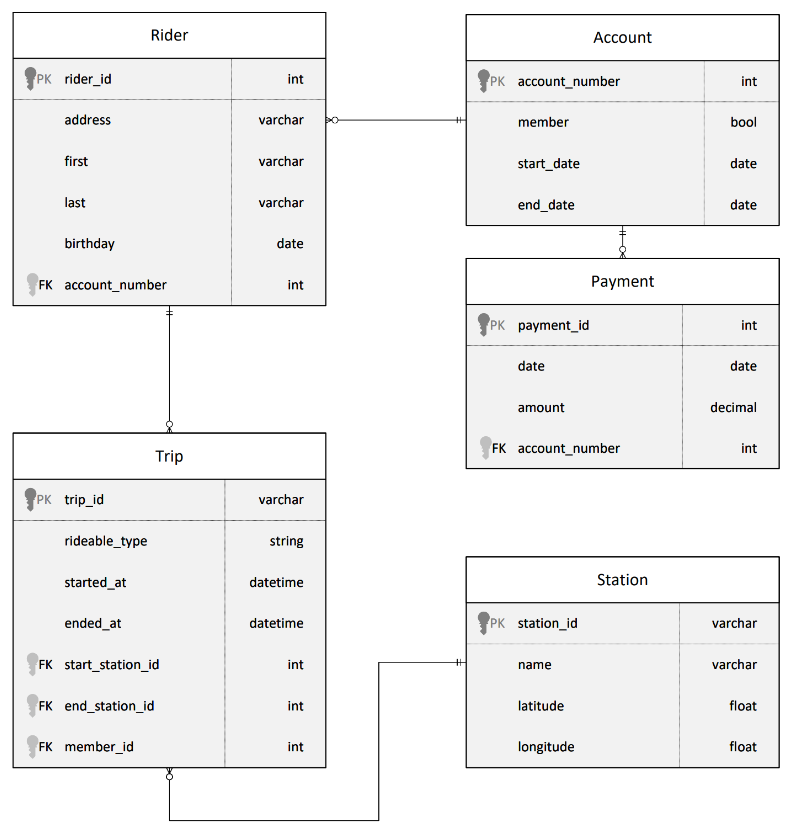

The goal of this project is to develop a data lake solution using Azure Databricks using a lake house architecture. You will:
•	Design a star schema based on the business outcomes listed below.

•	Import the data into Azure Databricks using Delta Lake to create a Bronze data store.

•	Create a gold data store in Delta Lake tables.

•	Transform the data into the star schema for a Gold data store.

### Design Bikeshare Star Schema
### Based on the given set of business requirements the following star schema was designed
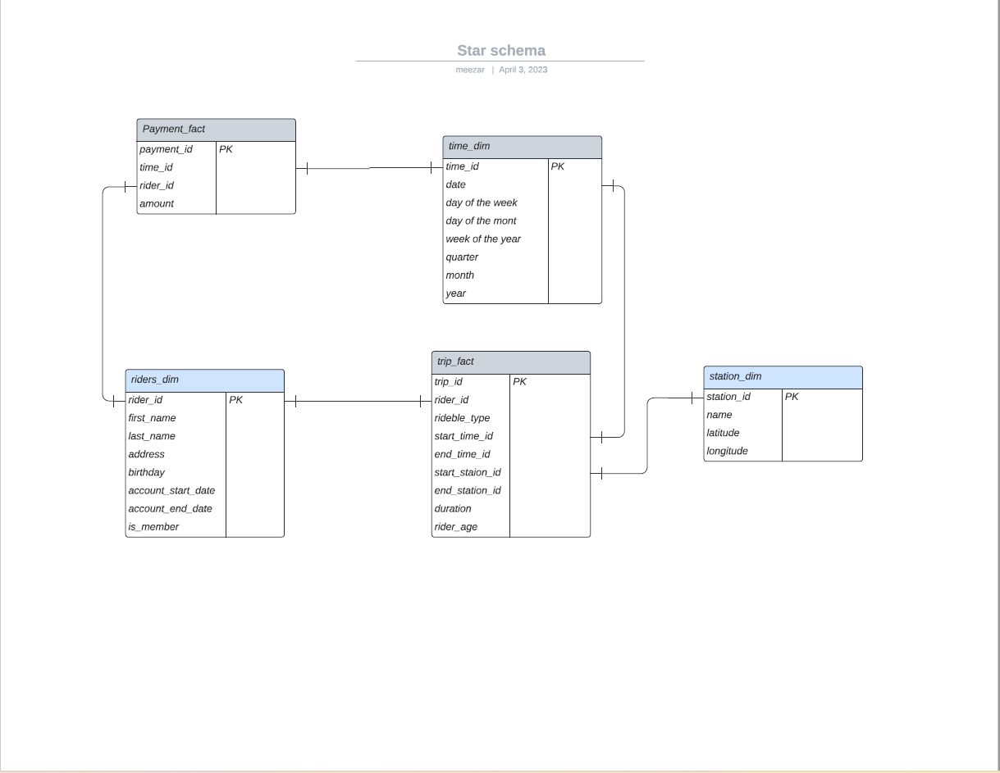

### Create Azure Data bricks
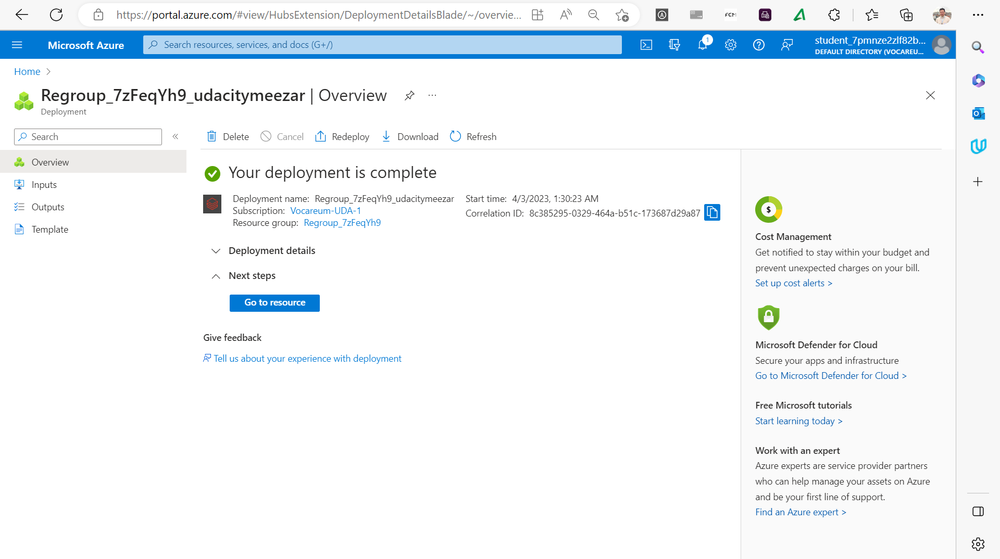

### Create Cluster
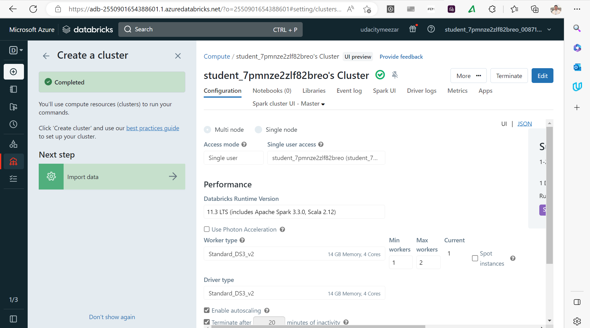

## Load the Bikeshare CSV files to DFBS 
### Drag and drop the CSV files to DFBS and load it as shown 
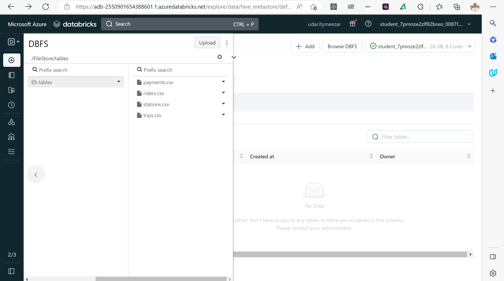

### picks files up from the Databricks file system storage and writes it out to Delta file locations
By create notebook with python inside data Bricks workspace extract table first
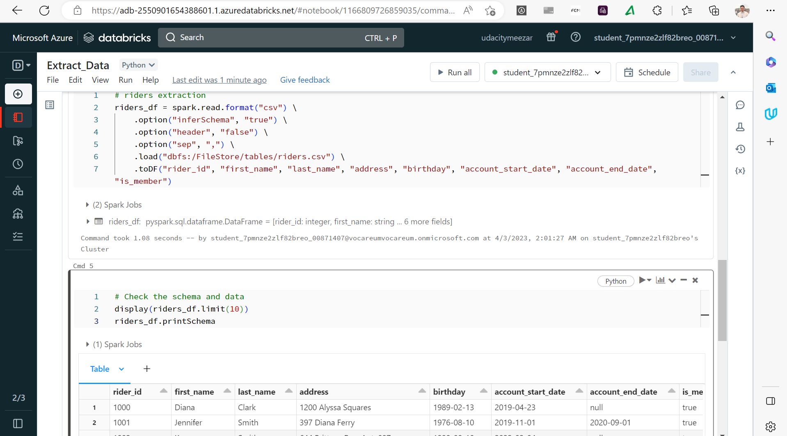
Then we write the riders table to delta location 
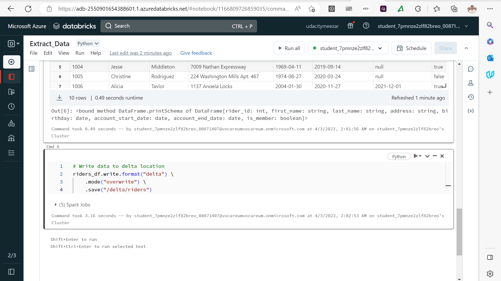

### useing spark.sql statements to create the tables and then load data from the files that were extracted in the Extract step.
### By create new notebook Create_spark_SQL_Table

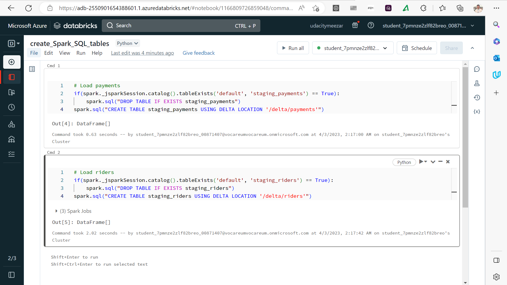

We can check the tables existing in hive_metastore as shown
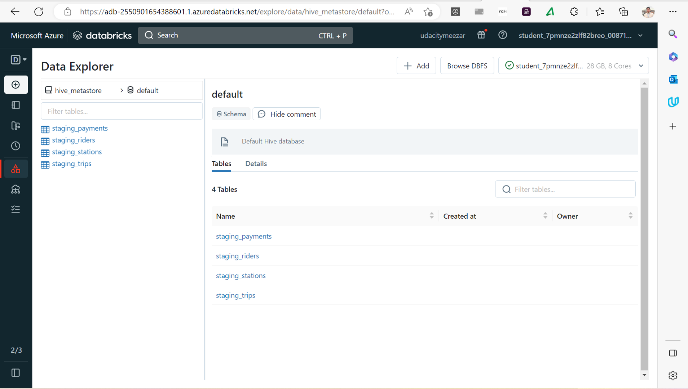

### fact table Python scripts contain appropriate keys from the dimensions. based on the diagrams created above in the Bikeshare Star Schema.
### So I create Python notebook Transform_data_intoStar_schema
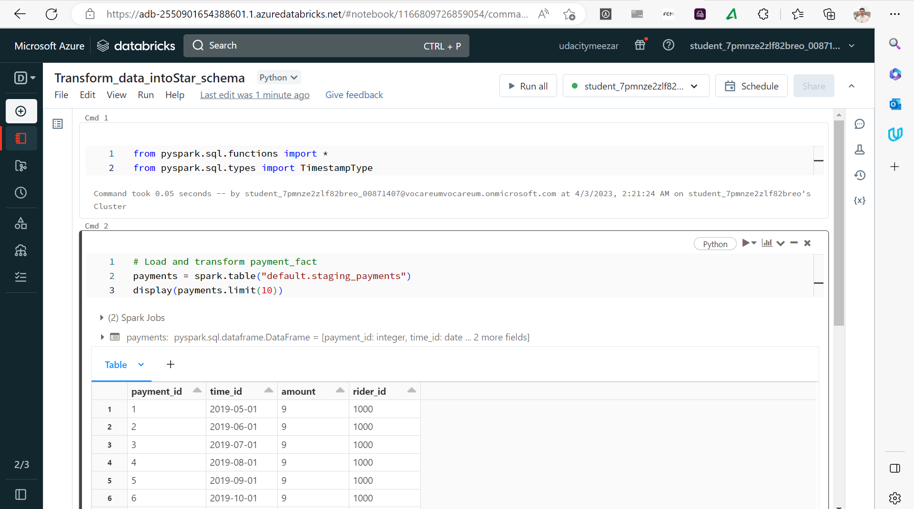
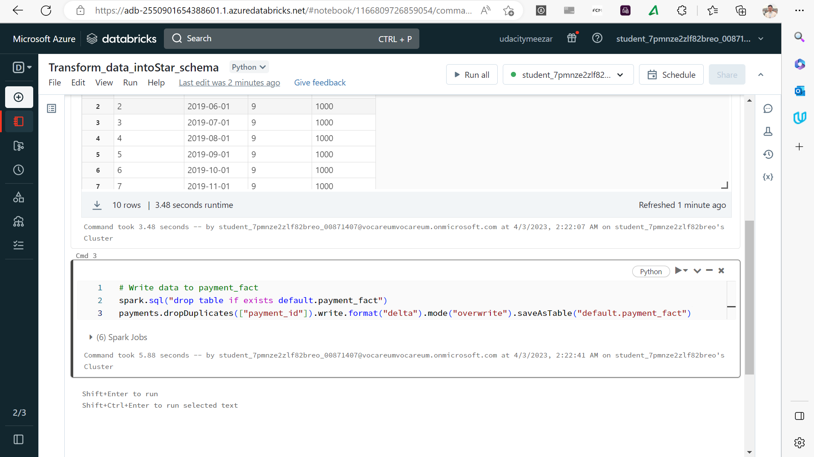
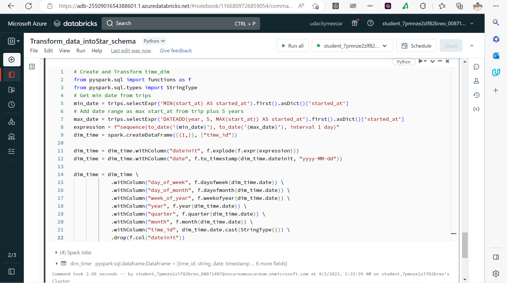
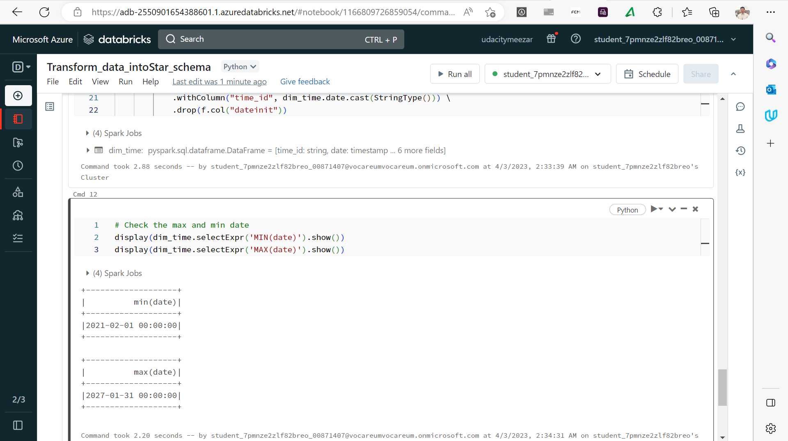

### Now we can check and confirm the transformed  table that we create Dimension and fact table as below,
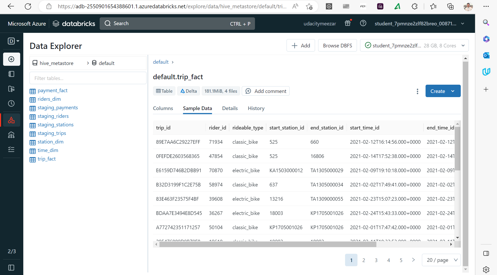
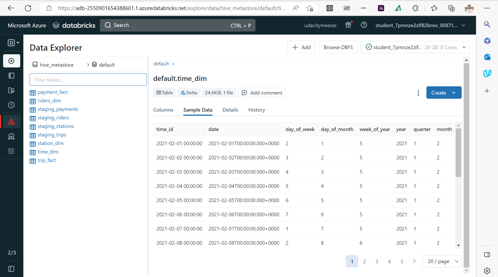
